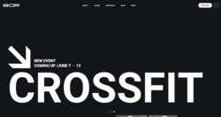
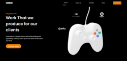
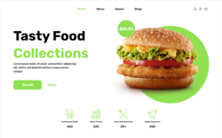

##### About me:
  
💨💨💨
## I'm a *self-taught* beginner frontend developer💻...   
...My journey into coding began with a fascination with how websites work, a desire to create things digitally.   My path is just starting, but every line of code is a step toward mastery🎓  
I thrive on challenges and love the process of learning — whether it’s debugging tricky JavaScript issues, optimizing CSS for smoother animations, or exploring new frameworks. Every project, big or small, is an opportunity to grow and refine my skills📈

 
> *"Fail fast, learn faster!"*

╰┈➤ *Learning → Coding → Repeating* ↳↰  
###### I believe in "learning by doing" — whether it’s through personal projects or breaking things in a controlled environment.   Clean code, user-centric design, and continuous improvement are what drive me forward.

### **🔧 Tech Toolkit:**  

 ✔️ Comfortable with: 
  

  - HTML (HTML5),
  - CSS (CSS3),
  - *CSS Preprocessors:* Sass/SCSS, 
  - *CSS Methodologies:* BEM,
  - Adaptive layouts (mobile/desktop) with media queries.   
  - *Version Control:* Git (GitHub),
  - *IDE/Editors:* WebStorm, VS Code (with extensions like ESLint, styleLint, Prettier),
  - *Browser DevTools,*  
  - *Figma and Pixso*,
  - *Package Managers:* NPM,
  - Vanilla JavaScript;

 🕮 Currently learning: 
  
  
  - Accessibility,
  - JSX (JavaScript XML) for React,
  - *Build Tools:* Vite and Webpack,
  - Minista,

 💻 Dream stack: 
 
  
  - React, Next.js,
  - CSS Frameworks: Bootstrap, TailwindCSS,
  - Some Libraries,
  - CMS and PHP,
  - __and a lot more...__

 

=͟͟͞͞ ⌧ How to reach me: https://t.me/saneckaz 

### Links to projects from my portfolio:

 - [FutureTech](https://github.com/Alexan0103/FutureTech) ⏬
    

      
 Open Preview Image
 
  
   
   
    

 - [Kropp-CrossFIt](https://github.com/Alexan0103/Kropp-CrossFIt) ⏬
    

      
 Open Preview Image
 
  
   

    

   
 - [GameLanding](https://github.com/Alexan0103/GameLanding) ⏬
    

      
 Open Preview Image
 
  
    

    

   

 - [BurgerLanding](https://github.com/Alexan0103/BurgerLanding) ⏬
    

      
 Open Preview Image
 
  
   

    

   

 

   _I`m actively developing new projects and learning new technology, stay tuned!_
   >"The web is a canvas, and code is the brush — I'm just starting, to be an artist."
   ---  
   
    
   

__🛠️🛠️🛠️__

  
